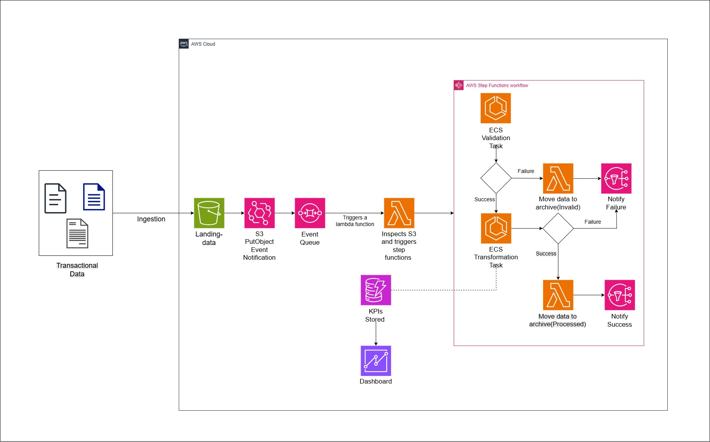

# E-commerce Pipeline Documentation

## Overview

The **E-commerce Pipeline** is an automated data processing workflow designed to validate and transform e-commerce transactional data, compute key performance indicators (KPIs), and store the results in DynamoDB. The pipeline is triggered by S3 events, processes data through a series of validation and transformation steps using ECS Fargate tasks, archives the data in S3, and sends notifications via SNS. The entire workflow is orchestrated using AWS Step Functions, ensuring reliability, error handling, and monitoring.

### Objectives
- **Validate Data**: Ensure incoming e-commerce data (products, orders, order items) meets predefined criteria.
- **Transform Data**: Compute category-level and order-level KPIs from validated data.
- **Store Results**: Save computed KPIs to DynamoDB for downstream analytics.
- **Archive Data**: Move processed or invalid data to appropriate S3 prefixes for archival.
- **Notify Stakeholders**: Send success or failure notifications via SNS.

### Key Features
- **Serverless Architecture**: Leverages AWS Step Functions, ECS Fargate, Lambda, S3, SNS, and DynamoDB for a fully serverless solution.
- **Retry Logic**: Includes retry policies for ECS tasks and Lambda functions to handle transient failures.
- **Error Handling**: Robust error handling with fallback paths for invalid data and failure notifications.
- **Monitoring**: Integrates with CloudWatch for logging and monitoring.

---

## Architecture

### Architecture Diagram


### Architecture Diagram Description
The E-commerce Pipeline architecture consists of the following components, interconnected to form a seamless workflow:

1. **S3 Bucket (`<s3-bucket-name>`)**:
   - Stores raw e-commerce data in the `landing-data/` prefix.
   - Archives data in `archive/processed-data/` (successful runs) or `archive/invalid-data/` (failed validations).
   - Triggers the pipeline via S3 events.

2. **SQS Queue (`<sqs-queue-name>`)**:
   - Receives S3 event notifications for new file uploads to `landing-data/`.
   - Ensures reliable event delivery to the pipeline.

3. **Lambda Function (`<s3-event-lambda-name>`)**:
   - Polls the SQS queue for S3 events.
   - Triggers the Step Functions state machine execution.

4. **Step Functions State Machine (`EcommercePipeline`)**:
   - Orchestrates the entire workflow.
   - Manages validation, transformation, data movement, and notifications.
   - Includes retry logic for transient failures and error handling for invalid data.

5. **ECS Fargate Tasks**:
   - **Validation Task (`<validation-task-name>`)**: Validates incoming data using a containerized application.
   - **Transformation Task (`<transformation-task-name>`)**: Transforms validated data and computes KPIs, storing results in DynamoDB.

6. **DynamoDB Tables**:
   - **CategoryKPIs**: Stores category-level KPIs.
   - **OrderKPIs**: Stores order-level KPIs.

7. **Lambda Function (`<move-s3-files-lambda-name>`)**:
   - Moves files between S3 prefixes (e.g., from `landing-data/` to `archive/processed-data/` or `archive/invalid-data/`).

8. **SNS Topic (`<sns-topic-name>`)**:
   - Sends notifications on pipeline success or failure.
   - Subscribed endpoints (e.g., email, SMS) receive these notifications.

9. **CloudWatch Logs**:
   - Logs ECS task executions, Lambda invocations, and Step Functions execution history for monitoring and debugging.

**Diagram Flow**:
- S3 (`landing-data/`) → SQS → Lambda (`<s3-event-lambda-name>`) → Step Functions (`EcommercePipeline`)
- Step Functions:
  - Runs `RunValidationTask` (ECS Fargate).
  - If validation fails → `MoveToInvalidData` (Lambda) → `NotifyInvalidDataMoved` (SNS) → `Fail`.
  - If validation succeeds → `RunTransformationTask` (ECS Fargate) → `MoveToProcessedData` (Lambda) → `NotifySuccess` (SNS) → `Success`.
- Data is archived in S3 (`archive/processed-data/` or `archive/invalid-data/`).
- KPIs are stored in DynamoDB (`CategoryKPIs`, `OrderKPIs`).
- Notifications are sent via SNS.

---

## Pipeline Workflow

The pipeline is implemented as an AWS Step Functions state machine named `EcommercePipeline`. The state machine definition is available in the repository (`state-machine/EcommercePipeline-StateMachine.json`). Below is a detailed breakdown of the workflow:

1. **Trigger**:
   - The pipeline starts when new files are uploaded to the `landing-data/` prefix in the S3 bucket.
   - S3 events are sent to an SQS queue, which is polled by a Lambda function (`<s3-event-lambda-name>`).
   - The Lambda function triggers the `EcommercePipeline` state machine.

2. **Validation (`RunValidationTask`)**:
   - An ECS Fargate task (`<validation-task-name>`) validates the incoming data (e.g., checks for required columns, data types).
   - If validation succeeds, the pipeline proceeds to `RunTransformationTask`.
   - If validation fails, it transitions to `MoveToInvalidData`.

3. **Move Invalid Data (`MoveToInvalidData`)**:
   - A Lambda function (`<move-s3-files-lambda-name>`) moves the invalid data from `landing-data/` to `archive/invalid-data/`.
   - The result is checked in `CheckMoveToInvalidDataResult`.

4. **Check Move Result (`CheckMoveToInvalidDataResult`)**:
   - A `Choice` state checks the Lambda response:
     - If `statusCode` is 200 (success), it transitions to `NotifyInvalidDataMoved`.
     - Otherwise, it transitions to `NotifyFailure`.

5. **Notify Invalid Data Moved (`NotifyInvalidDataMoved`)**:
   - Sends an SNS notification indicating that the pipeline failed at validation and the data was moved to `archive/invalid-data/`.
   - Transitions to `Fail`.

6. **Transformation (`RunTransformationTask`)**:
   - An ECS Fargate task (`<transformation-task-name>`) transforms the validated data and computes KPIs.
   - Stores the KPIs in DynamoDB (`CategoryKPIs` and `OrderKPIs`).
   - If successful, proceeds to `MoveToProcessedData`.
   - If it fails, transitions to `NotifyFailure`.

7. **Move Processed Data (`MoveToProcessedData`)**:
   - A Lambda function (`<move-s3-files-lambda-name>`) moves the processed data from `landing-data/` to `archive/processed-data/`.
   - If successful, proceeds to `NotifySuccess`.
   - If it fails, transitions to `NotifyFailure`.

8. **Notify Success (`NotifySuccess`)**:
   - Sends an SNS notification indicating that the pipeline completed successfully and KPIs were saved to DynamoDB.
   - Transitions to `Success`.

9. **Notify Failure (`NotifyFailure`)**:
   - Sends an SNS notification with details of the failure, including the failed state name (e.g., `RunValidationTask`, `RunTransformationTask`) and the error message.
   - Transitions to `Fail`.

10. **End States**:
    - `Success`: Indicates the pipeline completed successfully.
    - `Fail`: Indicates the pipeline failed (e.g., due to invalid data or an error).

---

## Setup and Deployment

This section provides simple instructions to set up the E-commerce Pipeline project using the AWS Management Console. You’ll build Docker images and push them to Amazon ECR using the command line, but all other AWS setup will be done through the console. The instructions assume you have the repository cloned locally.

### Prerequisites
- **AWS Account**: With permissions to create and manage S3, SQS, Lambda, Step Functions, ECS, ECR, DynamoDB, SNS, and CloudWatch resources.
- **AWS CLI**: Installed and configured with credentials for pushing Docker images to ECR.
- **Docker**: Installed on your local machine for building Docker images.
- **Git**: To clone the repository.
- **Repository**: Clone the project repository containing the code for the pipeline, including:
  - `scripts/step_function.json`: Step Functions state machine definition.
  - `scripts/lambda_functions/CheckS3AndTriggerEcommercePipeline.py`: Code for the S3 event Lambda function.
  - `docker-images/validation/`: Code and Dockerfile for the validation task.
  - `docker-images/transformation/`: Code and Dockerfile for the transformation task.
  - `test-data/`: Sample data for testing (e.g., `products.csv`, `orders/order1.csv`, `order_items/order_items_part1.csv`).

### Step 1: Clone the Repository
1. Clone the repository to your local machine using Git.
2. Navigate to the project directory.

### Step 2: Build Docker Images and Push to ECR

#### 2.1 Create ECR Repositories
1. Go to the AWS Management Console > **ECR**.
2. Click **Create repository**:
   - Name: `<validation-task-name>` (e.g., `validation-task`).
   - Create the repository.
3. Repeat to create another repository named `<transformation-task-name>` (e.g., `transformation-task`).
4. Note the repository URIs (e.g., `<account-id>.dkr.ecr.<region>.amazonaws.com/<validation-task-name>`).

5. Authenticate Docker to your ECR registry using the AWS CLI:
   - Run the following command in your terminal:
     ```
     aws ecr get-login-password --region <region> | docker login --username AWS --password-stdin <account-id>.dkr.ecr.<region>.amazonaws.com
     ```
   - Replace `<region>` with your AWS region (e.g., `eu-west-1`) and `<account-id>` with your AWS account ID.

#### 2.2 Build and Push the Validation Task Docker Image
1. Navigate to the validation task directory in your terminal:
   ```
   cd docker/validation-task
   ```
   - This directory should contain the application code and a `Dockerfile`.

2. Build the Docker image:
   ```
   docker build -t <validation-task-name> .
   ```

3. Tag the image for ECR:
   ```
   docker tag <validation-task-name>:latest <account-id>.dkr.ecr.<region>.amazonaws.com/<validation-task-name>:latest
   ```

4. Push the image to ECR:
   ```
   docker push <account-id>.dkr.ecr.<region>.amazonaws.com/<validation-task-name>:latest
   ```

#### 2.3 Build and Push the Transformation Task Docker Image
1. Navigate to the transformation task directory:
   ```
   cd ../transformation-task
   ```
   - This directory should contain the application code and a `Dockerfile`.

2. Build the Docker image:
   ```
   docker build -t <transformation-task-name> .
   ```

3. Tag the image for ECR:
   ```
   docker tag <transformation-task-name>:latest <account-id>.dkr.ecr.<region>.amazonaws.com/<transformation-task-name>:latest
   ```

4. Push the image to ECR:
   ```
   docker push <account-id>.dkr.ecr.<region>.amazonaws.com/<transformation-task-name>:latest
   ```

### Step 3: Create IAM Roles
1. Go to **IAM** > **Roles** > **Create role**.
2. **Step Functions Execution Role**:
   - Select **AWS service** > **Step Functions** as the trusted entity.
   - Attach policies:
     - Permissions for ECS (`ecs:RunTask`, `ecs:StopTask`, `ecs:DescribeTasks`).
     - Permissions for Lambda (`lambda:InvokeFunction`).
     - Permissions for SNS (`sns:Publish`).
     - Permissions for CloudWatch Logs (`logs:*`).
   - Name the role `StepFunctions-EcommercePipeline-Role`.

3. **ECS Task Execution Role**:
   - Select **AWS service** > **Elastic Container Service** > **Elastic Container Service Task**.
   - Attach policies:
     - Permissions to pull images from ECR (`ecr:BatchGetImage`, `ecr:GetDownloadUrlForLayer`).
     - Permissions to write logs to CloudWatch (`logs:*`).
     - Permissions to write to DynamoDB (`dynamodb:PutItem`).
   - Name the role `ecsTaskExecutionRole`.

4. **Lambda Execution Role**:
   - Select **AWS service** > **Lambda**.
   - Attach policies:
     - Permissions to poll SQS (`sqs:ReceiveMessage`, `sqs:DeleteMessage`, `sqs:GetQueueAttributes`).
     - Permissions to start Step Functions executions (`states:StartExecution`).
     - Permissions to access S3 (`s3:*`).
     - Permissions to write logs to CloudWatch (`logs:*`).
   - Name the role `LambdaExecutionRole`.

### Step 4: Create S3 Bucket
1. Go to **S3** > **Create bucket**.
2. Name it `<s3-bucket-name>` and select your region (e.g., `eu-west-1`).
3. Create folders:
   - Click **Create folder** and name it `landing-data`.
   - Create folders `archive/processed-data` and `archive/invalid-data`.

### Step 5: Create SQS Queue
1. Go to **SQS** > **Create queue**.
2. Select **Standard Queue**, name it `<sqs-queue-name>`, and create it.
3. Go to the S3 bucket > **Properties** > **Event notifications** > **Create event notification**.
   - Name: `LandingDataUpload`.
   - Event types: Select **All object create events**.
   - Prefix: `landing-data/`.
   - Destination: **SQS queue**, select `<sqs-queue-name>`.
4. In the SQS queue, go to **Access policy** and allow S3 to send messages:
   - Edit the policy to allow `s3.amazonaws.com` to perform `sqs:SendMessage` on this queue, with the condition that the source is your S3 bucket.

### Step 6: Deploy Lambda Functions
1. **S3 Event Lambda (`<s3-event-lambda-name>`)**:
   - Go to **Lambda** > **Create function**.
   - Name: `<s3-event-lambda-name>`.
   - Runtime: Node.js 18.x.
   - Role: Select `LambdaExecutionRole`.
   - Upload the code:
     - Go to the `lambda/<s3-event-lambda-name>` directory on your local machine.
     - Zip the contents (e.g., `index.js`, `package.json`).
     - In the Lambda console, upload the zip file.
   - Add a trigger:
     - Go to **Add trigger** > Select **SQS**.
     - Choose `<sqs-queue-name>`.

2. **Move S3 Files Lambda (`<move-s3-files-lambda-name>`)**:
   - Go to **Lambda** > **Create function**.
   - Name: `<move-s3-files-lambda-name>`.
   - Runtime: Node.js 18.x.
   - Role: Select `LambdaExecutionRole`.
   - Upload the code:
     - Go to the `lambda/<move-s3-files-lambda-name>` directory on your local machine.
     - Zip the contents.
     - Upload the zip file in the Lambda console.

### Step 7: Create ECS Cluster and Task Definitions
1. **Create the ECS Cluster**:
   - Go to **ECS** > **Clusters** > **Create cluster**.
   - Name: `<cluster-name>`.
   - Infrastructure: Select **AWS Fargate (serverless)**.
   - Create the cluster.

2. **Create Task Definitions**:
   - Go to **ECS** > **Task definitions** > **Create new task definition**.
   - **Validation Task**:
     - Name: `<validation-task-name>`.
     - Infrastructure: Fargate.
     - CPU: 0.25 vCPU, Memory: 0.5 GB.
     - Task role and execution role: `ecsTaskExecutionRole`.
     - Add a container:
       - Name: `<validation-task-name>`.
       - Image: `<account-id>.dkr.ecr.<region>.amazonaws.com/<validation-task-name>:latest`.
       - Enable logging: Select **CloudWatch Logs**, log group `/ecs/<validation-task-name>`.
     - Create the task definition.
   - **Transformation Task**:
     - Repeat the steps above.
     - Name: `<transformation-task-name>`.
     - Image: `<account-id>.dkr.ecr.<region>.amazonaws.com/<transformation-task-name>:latest`.
     - Log group: `/ecs/<transformation-task-name>`.

3. **Create CloudWatch Log Groups**:
   - Go to **CloudWatch** > **Log groups** > **Create log group**.
   - Create two log groups: `/ecs/<validation-task-name>` and `/ecs/<transformation-task-name>`.

### Step 8: Create DynamoDB Tables
1. Go to **DynamoDB** > **Tables** > **Create table**.
2. **CategoryKPIs**:
   - Table name: `CategoryKPIs`.
   - Partition key: `Category` (String).
   - Use default settings for capacity.
3. **OrderKPIs**:
   - Table name: `OrderKPIs`.
   - Partition key: `OrderId` (String).
   - Use default settings.

### Step 9: Create SNS Topic
1. Go to **SNS** > **Topics** > **Create topic**.
2. Name: `<sns-topic-name>`.
3. Create a subscription:
   - Protocol: Email.
   - Endpoint: Your email address.
   - Confirm the subscription via the email you receive.

### Step 10: Create Step Functions State Machine
1. Go to **Step Functions** > **State machines** > **Create state machine**.
2. Name: `EcommercePipeline`.
3. Use the **Code** option:
   - Open `scripts/step_function.json` from the repository.
   - Replace placeholders with actual values (e.g., ARNs for the cluster, task definitions, Lambda functions, SNS topic, subnets, security groups).
   - Copy and paste the updated JSON into the console.
4. Role: Select `StepFunctions-EcommercePipeline-Role`.
5. Enable logging:
   - Go to **Logging** > Enable **CloudWatch Logs**.
   - Log level: **ALL**.
   - Create a new log group: `/aws/states/EcommercePipeline`.

### Step 11: Test the Pipeline
1. **Success Scenario**:
   - Go to **S3** > `<s3-bucket-name>` > `landing-data`.
   - Upload the test files from the repository (`test-data/products.csv`, `test-data/orders/order1.csv`, `test-data/order_items/order_items_part1.csv`).
   - Go to **Step Functions** > `EcommercePipeline` and check the latest execution.
   - Verify that data is moved to `archive/processed-data/`, KPIs are in DynamoDB, and you receive an SNS success notification.

2. **Failure Scenario**:
   - Upload invalid data (e.g., modify `products.csv` to remove required columns).
   - Verify that the pipeline fails at validation, data is moved to `archive/invalid-data/`, and you receive an SNS failure notification.

---

## Monitoring and Troubleshooting

### Monitoring
- **Step Functions Execution History**:
  - View execution details in the Step Functions console to track the state machine’s progress.
  - Check for retries, failures, and transitions.
- **CloudWatch Logs**:
  - ECS task logs: `/ecs/<validation-task-name>` and `/ecs/<transformation-task-name>`.
  - Lambda logs: `/aws/lambda/<s3-event-lambda-name>` and `/aws/lambda/<move-s3-files-lambda-name>`.
  - Step Functions logs: `/aws/states/EcommercePipeline`.
- **SNS Notifications**:
  - Monitor SNS notifications for success or failure alerts.

### Troubleshooting
- **Validation Failure**:
  - Check the ECS task logs for `RunValidationTask` to identify why the data failed validation.
  - Ensure the data format matches the expected schema.
- **Transformation Failure**:
  - Check the ECS task logs for `RunTransformationTask` to debug transformation errors.
  - Verify DynamoDB permissions and table schema.
- **Lambda Errors**:
  - Check the Lambda logs for `MoveToInvalidData` or `MoveToProcessedData` to diagnose S3 access issues or throttling.
- **SNS Notification Issues**:
  - Ensure the SNS topic has active subscriptions.
  - Verify the Step Functions role has `sns:Publish` permissions.
- **Retry Behavior**:
  - If a task or Lambda function fails, check the execution history for retry attempts (up to 3 retries for specified errors).

---

## Conclusion

The E-commerce Pipeline provides a robust, serverless solution for processing e-commerce transactional data, computing KPIs, and storing results in DynamoDB. With AWS Step Functions at its core, the pipeline ensures reliability through retry logic, error handling, and comprehensive monitoring. The setup instructions above enable anyone to deploy the pipeline from the repository, making it accessible and maintainable for teams.

For any questions or issues, refer to the troubleshooting section or contact the pipeline maintainers.

